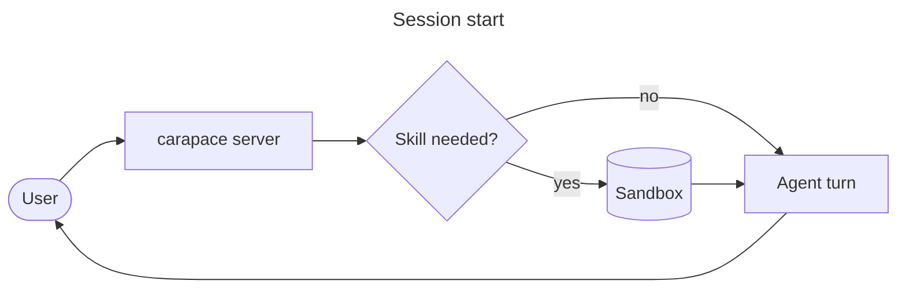

# Mermaid Diagrams

The carapace web UI renders every fenced ` ```mermaid ` block as a diagram. Write the
diagram directly into your reply — no tool call, no file, no image upload. The user gets
a toolbar on each diagram to flip to the source, copy it, or download the SVG.

Mermaid also renders in knowledge files: a ` ```mermaid ` block inside any `.md` in the
knowledge repo shows up as a diagram in the knowledge browser.

## When to use

Use a diagram when the structure *is* the answer:

- more than three things relate to each other (services, tables, modules)
- order matters across participants (request flows, handshakes, protocols)
- something has states and transitions (session lifecycle, deploy pipeline)
- a schedule or timeline needs to be seen side by side

Do **not** diagram a linear list of steps, a single comparison, or anything under three
nodes — prose or a table is better. One diagram per answer is usually the right number.

## Choosing a type

| Question                                       | Diagram          | Reference                                           |
| ---------------------------------------------- | ---------------- | --------------------------------------------------- |
| How does data/control move through the system? | `flowchart`      | [flowchart.md](references/flowchart.md)             |
| Who talks to whom, in what order?              | `sequenceDiagram`| [sequence.md](references/sequence.md)               |
| What states exist and how do they change?      | `stateDiagram-v2`| [state-class.md](references/state-class.md)         |
| How are the types/classes related?             | `classDiagram`   | [state-class.md](references/state-class.md)         |
| What does the schema look like?                | `erDiagram`      | [data-and-time.md](references/data-and-time.md)     |
| When does what happen?                         | `gantt`/`timeline`| [data-and-time.md](references/data-and-time.md)    |
| How do the numbers compare?                    | `xychart`/`pie`  | [data-and-time.md](references/data-and-time.md)     |
| Hierarchy, journey, git history, infrastructure| mindmap and friends | [misc.md](references/misc.md)                    |
| How do I color/theme it?                       | —                | [styling.md](references/styling.md)                 |

Read the reference for the type you picked before writing anything non-trivial. Each one
starts with a copy-paste-ready example.

## Rules that keep diagrams rendering

1. **Fence it as `mermaid`.** Any other language tag stays a code block.
2. **The UI renders with `securityLevel: "strict"`.** The finished SVG goes through
   DOMPurify — simple formatting in labels (`<br/>`, `<b>`, `<i>`) survives, scripts and
   event handlers do not — and `click … call fn()` callbacks never fire. Keep labels to
   text plus `<br/>` and put links in the prose next to the diagram.
3. **Quote labels containing punctuation.** `A["load(config)"]`, not `A[load(config)]`.
   Parentheses, brackets, braces, colons, commas and `#` all break unquoted labels.
4. **Node ids are identifiers**, not sentences: letters, digits, underscore. Never use
   `end` as an id in a flowchart (lowercase `end` closes a subgraph and breaks parsing) —
   use `done`, `finish`, or `End`.
5. **No hardcoded colors unless you need them.** The UI switches the mermaid theme with
   the app theme; a diagram with baked-in light colors becomes unreadable in dark mode.
   See [styling.md](references/styling.md) if you must.
6. **Comments are `%%` at line start.** Everything after is ignored.
7. **Keep it under ~25 nodes.** Past that, split into two diagrams or summarize.

## Shape of a good diagram



- direction `LR` for pipelines, `TD` for hierarchies and decisions
- an optional `title` in the YAML front matter of the fence
- labels are short noun phrases, detail goes in the prose around the diagram
- consistent shapes: rounded for actors, rectangles for components, cylinders for storage,
  diamonds for decisions

## Checking your work

Mermaid fails loudly: a syntax error means the UI keeps showing the source instead of a
picture. Before sending a diagram, re-read it for the two errors that cause almost all
failures — unquoted punctuation in a label, and a stray `end`/reserved word as a node id.
If a user reports that a diagram "shows as code", it did not parse — simplify the labels
and node ids and send it again.
