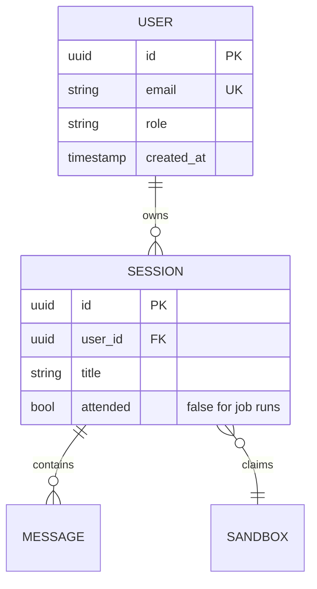
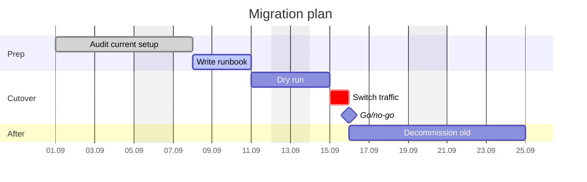
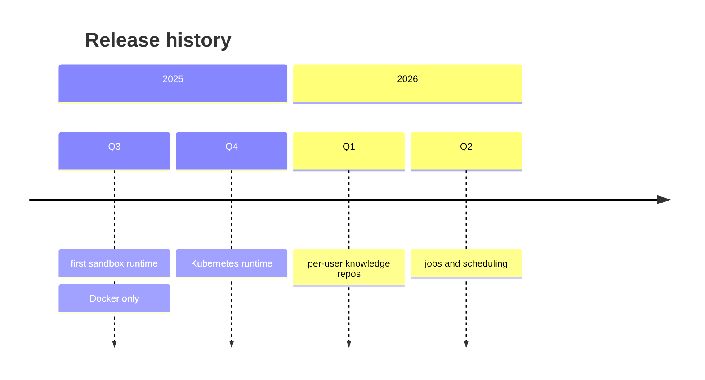
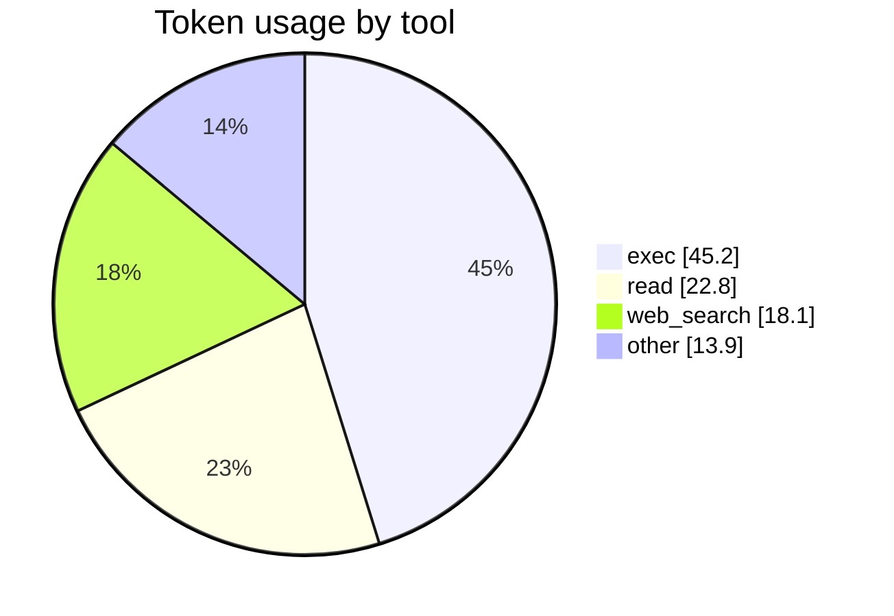
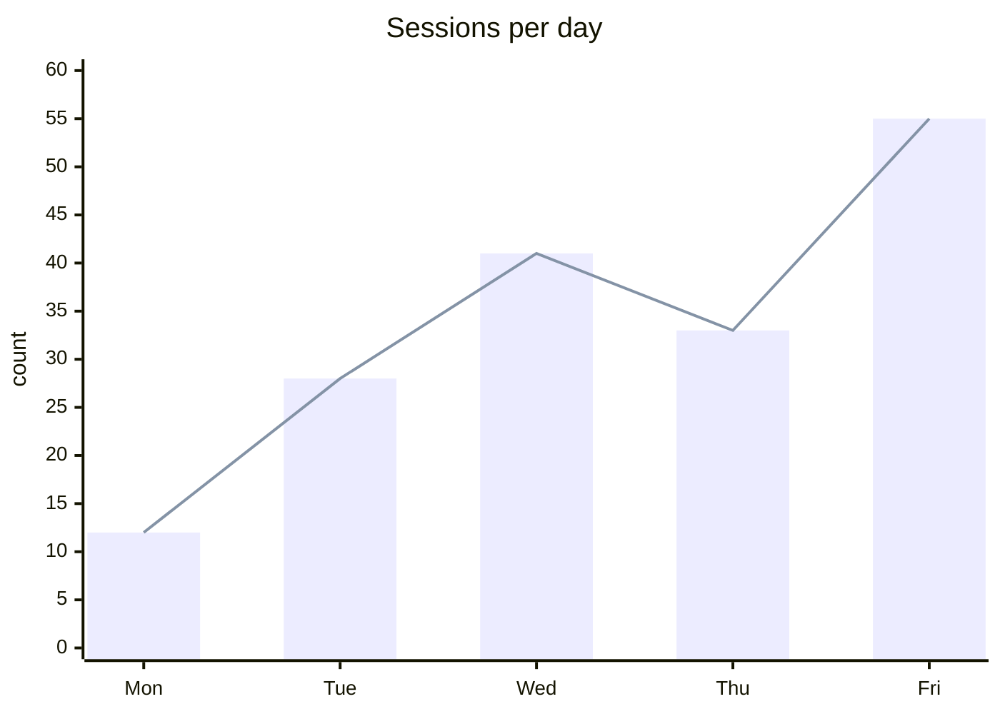
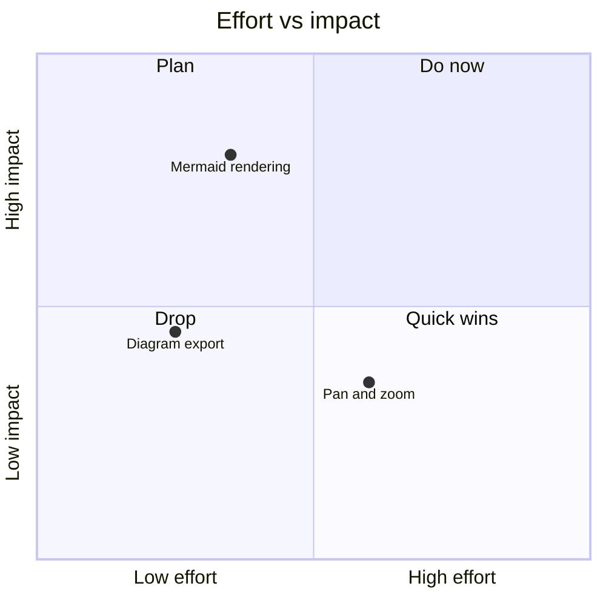
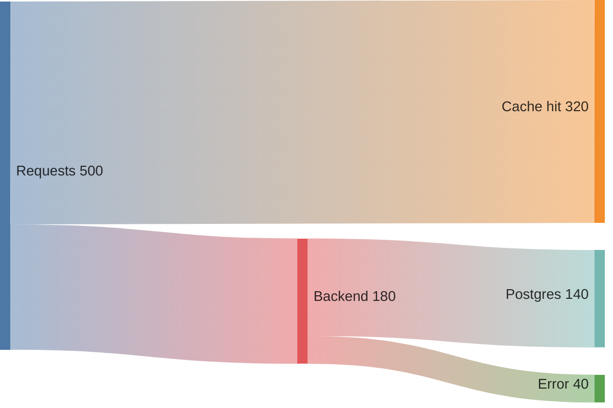

# Data, Schedules and Charts

`erDiagram` for schemas, `gantt`/`timeline` for time, `xychart`/`pie`/`quadrantChart`/
`sankey` for numbers.

## ER diagram — database schemas

Cardinality is written on both ends; left symbol reads first:

| Symbol | Meaning        |
| ------ | -------------- |
| `\|o`  | zero or one    |
| `\|\|` | exactly one    |
| `}o`   | zero or more   |
| `}\|`  | one or more    |

`--` between them means identifying (solid), `..` means non-identifying (dashed). The
label after the colon is required — use `""` if there is nothing to say.

Attribute lines are `type name [PK|FK|UK] ["comment"]`. Types are free text; use whatever
your database calls them. Names cannot contain spaces.

## Gantt — schedules and plans

Task line: `label : [tags,] id, start, duration`.

- tags: `done`, `active`, `crit`, `milestone` (comma-separated, any order)
- start: a date in `dateFormat`, or `after <id>` (chain from another task)
- duration: `3d`, `2w`, `6h`, or an end date
- `id` is only needed if another task references it

Header options: `dateFormat` (input parsing), `axisFormat` (display, strftime-style),
`excludes weekends` / `excludes 2026-12-24`, `tickInterval 1week`, `todayMarker off`.

## Timeline — history, roadmaps

Each `period : event : event` line puts multiple events under one period. Simpler than a
gantt when there are no durations or dependencies.

## Pie — parts of a whole

`showData` prints the raw values next to the legend. Labels must be quoted. Use it only
for three to six slices; beyond that a table beats a pie.

## XY chart — trends and comparisons

`xychart-beta horizontal` rotates it. Multiple `bar`/`line` series are allowed; there is
no legend, so name the series in the surrounding prose. Axis labels with spaces must be
quoted; a numeric x-axis is written `x-axis "load" 0 --> 100`.

## Quadrant chart — prioritization

Point coordinates are 0–1 on both axes. Quadrants are numbered counter-clockwise from the
top right.

## Sankey — flows and budgets

CSV body: `source,target,value`. Quote any name containing a comma. Good for traffic
splits, cost breakdowns and funnel drop-off.
