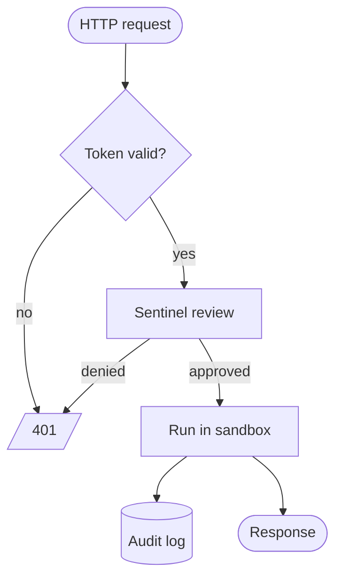
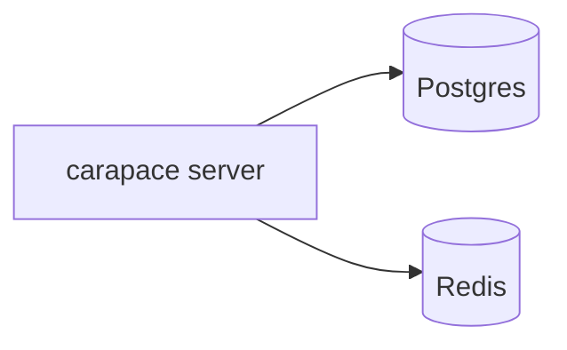
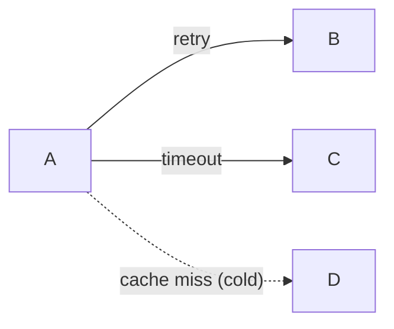
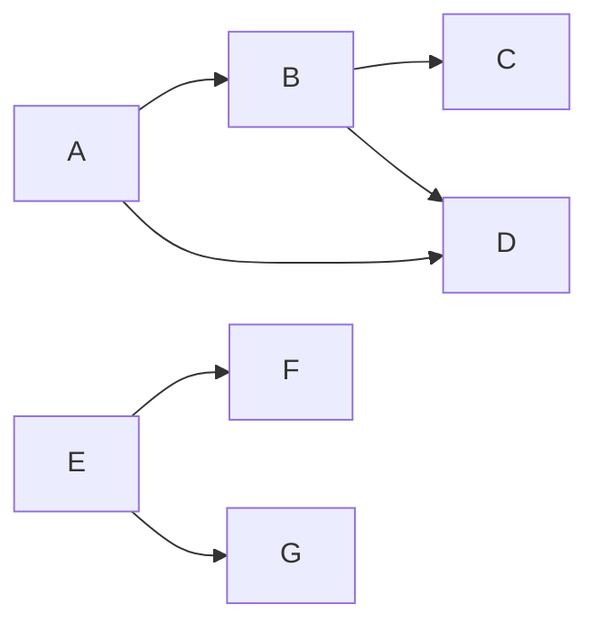
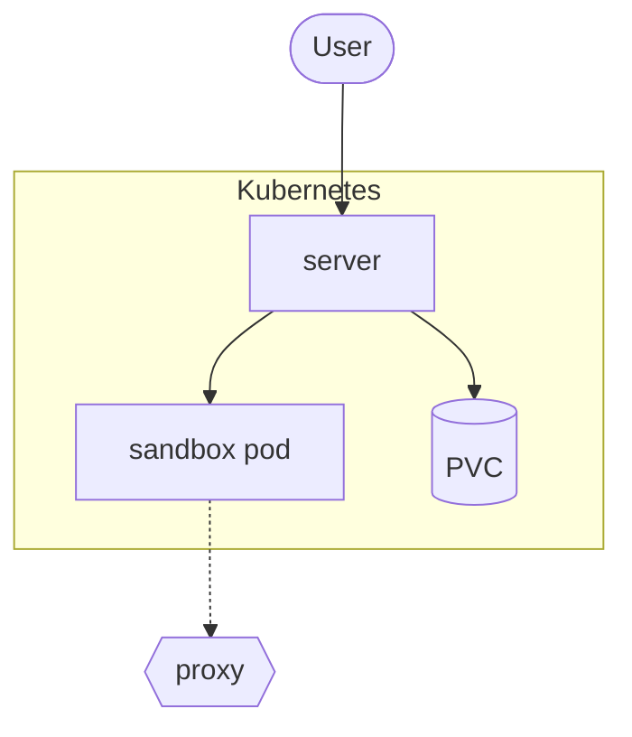
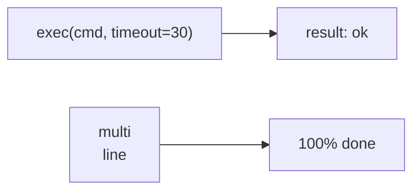

# Flowchart

The workhorse: components, data flow, decision trees, deployment paths. Use `flowchart`
(the modern renderer), not the older `graph` keyword.

## Direction

`flowchart TD` (top-down, default), `TB` (same), `BT`, `LR`, `RL`.

Pipelines and request flows read best as `LR`. Trees, hierarchies and decision logic read
best as `TD`. Wide `LR` diagrams scroll horizontally in the UI — keep them under ~8 stages.

## Node shapes

| Syntax                 | Shape          | Use for                     |
| ---------------------- | -------------- | --------------------------- |
| `A[Text]`              | rectangle      | process, component, service |
| `A(Text)`              | rounded        | soft step                   |
| `A([Text])`            | stadium        | start/end, actor            |
| `A[[Text]]`            | subroutine     | call into another flow      |
| `A[(Text)]`            | cylinder       | database, storage           |
| `A((Text))`            | circle         | connector, junction         |
| `A{Text}`              | diamond        | decision                    |
| `A{{Text}}`            | hexagon        | preparation                 |
| `A[/Text/]`            | parallelogram  | input/output                |
| `A[\Text\]`            | parallelogram ↺| alternate input/output      |
| `A[/Text\]`            | trapezoid      | manual step                 |
| `A(((Text)))`          | double circle  | terminal state              |

Declare a node once with its label, then refer to it by id alone:

### Extended shapes (mermaid 11.3+)

`A@{ shape: cyl, label: "Volume" }` unlocks the full shape catalog (`docs`, `event`,
`delay`, `junction`, `lin-cyl`, `braces`, `bolt`, …). Prefer the classic shapes above
unless you need one that has no short form — they are readable in source form too.

## Edges

| Syntax          | Meaning                        |
| --------------- | ------------------------------ |
| `A --> B`       | arrow                          |
| `A --- B`       | line, no arrow                 |
| `A -.-> B`      | dotted (async, optional path)  |
| `A ==> B`       | thick (hot path, main flow)    |
| `A --o B`       | circle end                     |
| `A --x B`       | cross end (terminates, fails)  |
| `A <--> B`      | bidirectional                  |
| `A ~~~ B`       | invisible (layout hint only)   |

Labels, two equivalent forms:

Longer arrows push nodes further apart: `A ---> B` ranks B one level deeper than `A --> B`.
Useful to straighten a layout without any styling.

Chains and multi-edges:

## Subgraphs

- `subgraph id [Display title]` — the id is what edges connect to; the bracketed title is
  what the user sees. `subgraph Title` alone works when the title is a single identifier.
- `direction LR` inside a subgraph overrides the parent direction for its contents.
- Edges may point at a subgraph id (`user --> k8s`) to connect to the whole box.
- **`end` closes the subgraph.** A node named `end` in the same diagram breaks parsing.

## Labels with punctuation

Quote anything that is not plain words and digits:

` ` gives a line break inside a label. Simple formatting tags (`<b>`, `<i>`) survive
the UI's DOMPurify pass too, but stay boring: markdown strings are the better tool —
backticks around a label (`` A["`bold **text**`"] ``) render `**bold**` and `*italic*`.

## Pitfalls

- `end` as a node id — breaks the parser. Also avoid `graph`, `subgraph`, `class`, `click`,
  `style`, `direction` as ids.
- Unquoted `(`, `)`, `[`, `]`, `{`, `}`, `,`, `:`, `#` inside labels.
- `o` or `x` directly after a node id at the start of an edge (`A---oB`) turns into a
  circle/cross edge — put spaces around the arrow.
- Comments must be on their own line; `A --> B %% why` is a parse error in some versions.
- Node ids are case-sensitive; `DB` and `db` are two different nodes.
