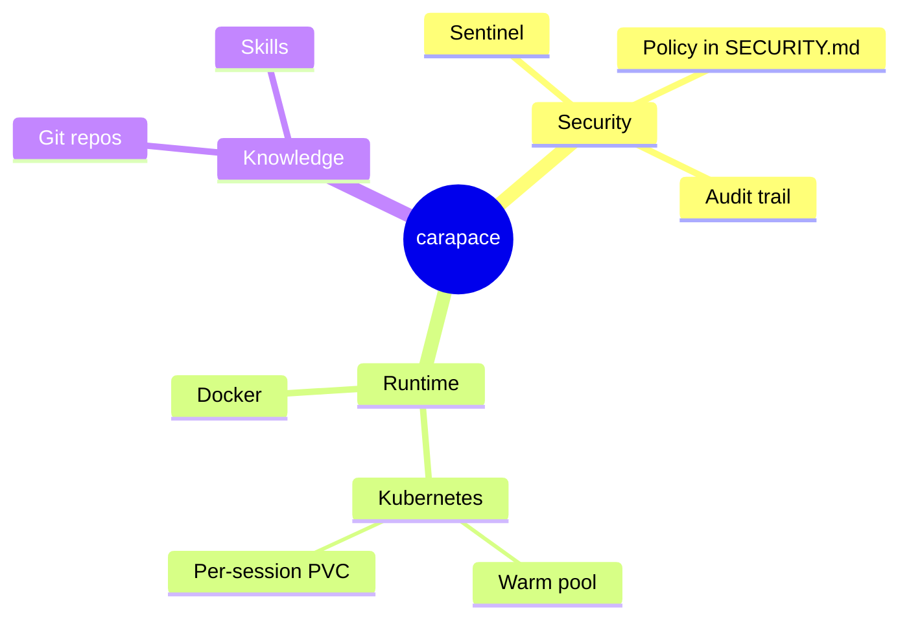
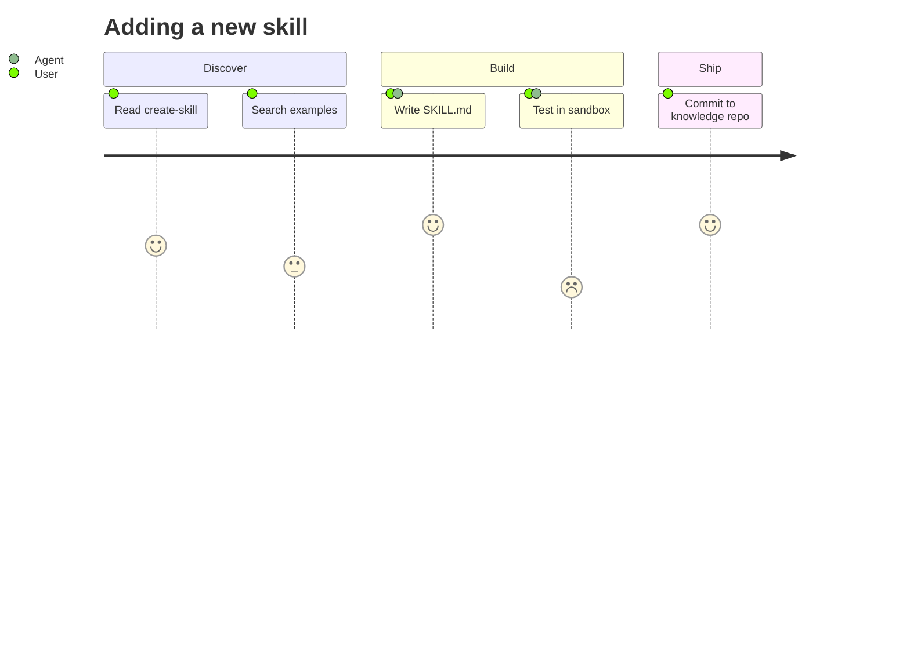
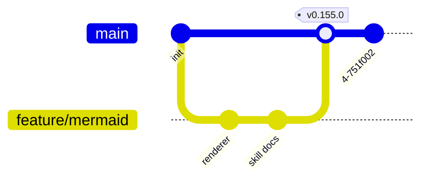
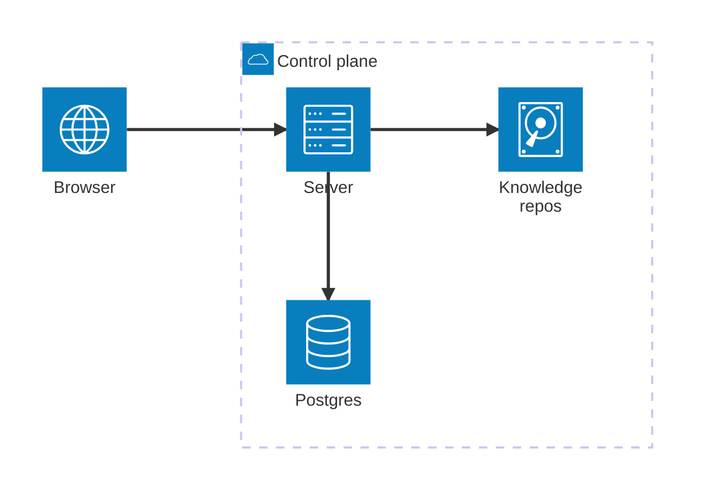
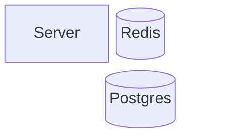
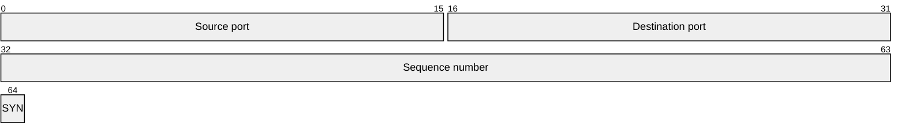
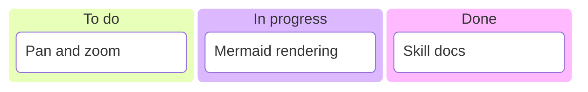

# Mindmap, Journey, Git Graph, Architecture and Friends

Less common types that are exactly right in their niche.

## Mindmap — hierarchies and brainstorms

Structure comes from **indentation only** — no arrows, no ids. Node shapes reuse the
flowchart forms on the text: `id[square]`, `id(round)`, `id((circle))`, `id))bang((`,
`id)cloud(`, `id{{hexagon}}`. Icons need an icon pack; skip them.

Indentation must be consistent (two spaces per level). Inconsistent indent is the one way
to break a mindmap.

## User journey — experience with sentiment

Line format: `Task: score: actors`. Score is 1–5 (low = painful). Actors are comma
separated. Use it to argue about where a workflow hurts.

## Git graph — branching stories

Commands: `commit [id: "x"] [tag: "v1"] [type: NORMAL|REVERSE|HIGHLIGHT]`, `branch name`,
`checkout name`, `merge name`, `cherry-pick id: "x"`. Options go in a `%%{init}%%`
directive: `%%{init: {'gitGraph': {'mainBranchName': 'trunk', 'showBranches': true}}}%%`.

## Architecture — infrastructure sketches

Only five icons ship by default: `cloud`, `database`, `disk`, `internet`, `server`. Edge
syntax is `src:SIDE --> SIDE:dst` with sides `T`, `B`, `L`, `R`; `--` for a plain line and
`-->` for an arrow. Junctions (`junction j1 in plane`) split shared edges.

For anything beyond a sketch, a `flowchart` with subgraphs gives more control.

## Block — layout-first boxes

`columns n` sets the grid, `:n` spans columns, `space` leaves a gap. Use it when the
*arrangement* is the message (memory layout, dashboards, panel structure) and edges are
secondary.

## Packet — binary formats

Bit ranges must be contiguous and start at 0. Perfect for protocol headers, useless for
anything else.

## Kanban — board snapshots

Columns are top-level, cards are indented. Metadata per card:
`t2[Task]@{ assigned: "thies", priority: "High" }`.

## Also available

`requirementDiagram` (formal requirements and their verification), `c4Context` (C4 model,
still experimental and rougher than a flowchart), `radar-beta`, `treemap-beta`,
`zenuml`. Reach for them only when the specific notation is being asked for.
