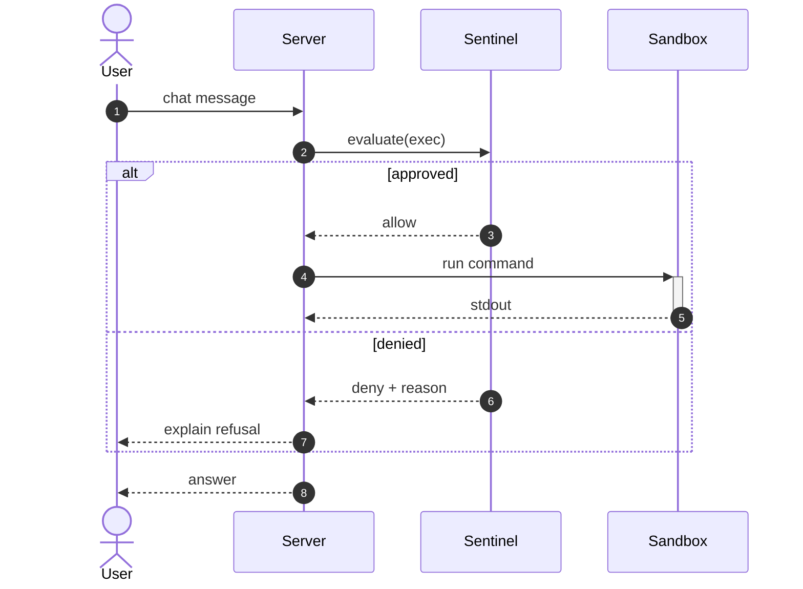
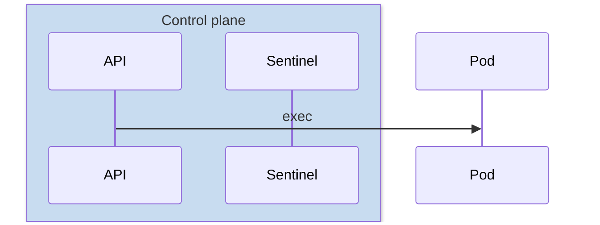

# Sequence Diagram

For anything where **order across participants** is the point: request flows, auth
handshakes, retries, protocol exchanges, agent turns.



## Participants

```
participant S as Server      %% box
actor U as User              %% stick figure
participant S                %% id doubles as label
create participant W as Worker   %% appears mid-diagram
destroy W                        %% removed mid-diagram
```

Declare participants in the order you want them left-to-right. Without declarations,
mermaid orders them by first appearance.

Group related participants:



Use `box transparent Label` if you do not want a fill — hardcoded box colors survive the
theme switch badly.

## Arrows

| Syntax    | Meaning                          |
| --------- | -------------------------------- |
| `->>`     | solid arrow — call, request      |
| `-->>`    | dashed arrow — return, response  |
| `->`      | solid line, no arrowhead         |
| `-->`     | dashed line, no arrowhead        |
| `-x`      | solid with cross — failure, drop |
| `--x`     | dashed with cross                |
| `-)`      | solid open arrow — async / fire-and-forget |
| `--)`     | dashed open arrow                |

Convention worth keeping: `->>` for requests, `-->>` for responses. A diagram that uses
solid arrows in both directions is much harder to read.

## Activation bars

```
S->>+SB: run          %% + activates SB
SB-->>-S: result      %% - deactivates SB
```

Equivalent explicit form: `activate SB` / `deactivate SB`. Nest by activating twice.

## Blocks

```
alt approved            %% branching
    ...
else denied
    ...
end

opt cache warm          %% optional path
    ...
end

loop every 30s          %% repetition
    ...
end

par write audit         %% parallel branches
    ...
and notify user
    ...
end

critical acquire lock   %% must-succeed with fallbacks
    ...
option timeout
    ...
end

break session expired   %% early exit
    ...
end
```

All of them close with `end`. They nest; keep nesting to two levels.

## Notes and separators

```
Note left of S: cold start
Note right of S: cached
Note over S,SB: shared PVC mounted here
```

Numbering: `autonumber` at the top numbers every message; `autonumber 10 10` starts at 10
and steps by 10.

Section headings inside the flow:

```
rect rgb(240,240,240)
    U->>S: only this block is highlighted
end
```

Prefer notes over `rect` — the rect color is fixed and will not follow the app theme.

## Pitfalls

- Every `alt`/`opt`/`loop`/`par`/`rect`/`box` needs its `end`. Missing `end` = the whole
  diagram stays source.
- A colon inside a message is fine (`S->>U: ratio 3:1`), but a colon in a **participant
  alias** is not — quote it or drop it.
- `participant` ids are case-sensitive and cannot contain spaces; use `as` for the label.
- `box` is a reserved word — a participant id of `Box` (any casing) fails to parse. Same for
  `end`, `note`, `loop`, `alt`, `par`, `activate`.
- Long messages do not wrap automatically. Keep them under ~40 characters or insert
  `<br/>`.
- More than ~8 participants stops fitting on screen; split the flow.
