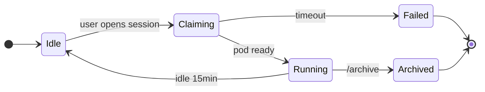
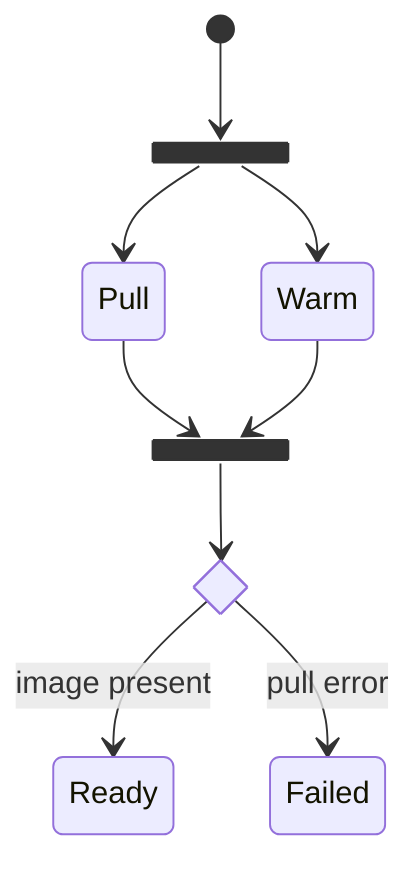
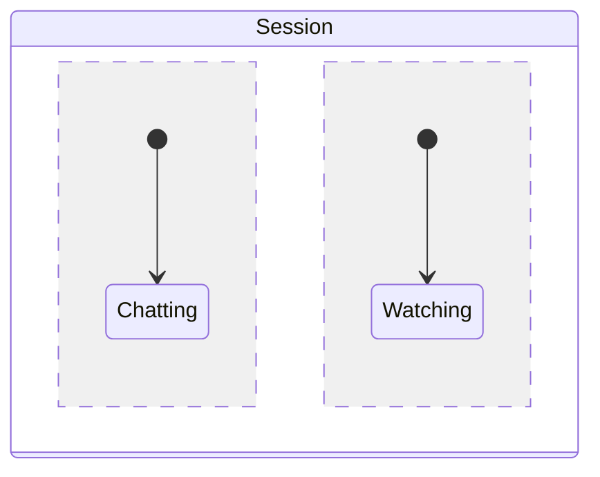
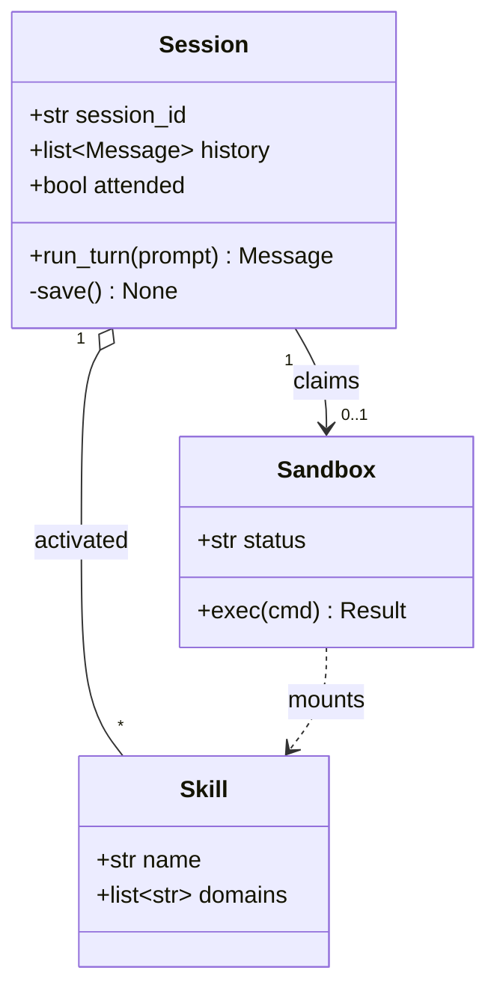

# State and Class Diagrams

Two structural diagrams: `stateDiagram-v2` for lifecycles, `classDiagram` for type
relationships.

## State diagram

Use it when a thing has a small set of states and rules for moving between them: session
lifecycle, sandbox status, job execution, approval workflow.



### Syntax

```
[*] --> First          %% [*] is the start (as source) and the end (as target)
s1 --> s2: label       %% transition label after a colon
state "Long name" as s1    %% id with a display label
state s2 {             %% composite state
    [*] --> inner
}
direction TB           %% TB or LR, also valid inside a composite
note right of s1: text    %% or `note left of`
```

Forks, joins, choices and concurrency:



Concurrent regions inside a composite state are separated by `--`:



### Pitfalls

- Always `stateDiagram-v2`; the old `stateDiagram` renderer is worse and lacks `direction`.
- State ids cannot contain spaces — use `state "With spaces" as s1`.
- A transition label goes after a colon on the same line, never in `|pipes|`.
- Note text does not wrap; keep it short.

## Class diagram

Use it for type/model relationships and module structure — not for runtime flow.



### Members

```
+public   -private   #protected   ~package
+field: type          %% or `+type field`, both parse
+method(arg) ReturnType
+method()* Abstract    %% trailing * = abstract
+method()$ Static      %% trailing $ = static
List~Message~          %% generics use ~ instead of < >
<<interface>> Foo      %% or <<abstract>>, <<enumeration>>, <<service>>
```

### Relations

| Syntax    | Meaning        | Read as                   |
| --------- | -------------- | ------------------------- |
| `<\|--`   | inheritance    | B is an A                 |
| `*--`     | composition    | A owns B, B dies with A   |
| `o--`     | aggregation    | A has B, B outlives A     |
| `-->`     | association    | A references B            |
| `--`      | link           | A relates to B            |
| `..>`     | dependency     | A uses B                  |
| `..\|>`   | realization    | B implements A            |
| `..`      | dashed link    | weak relation             |

Cardinality goes in quotes on either side, the label after a colon:

```
Customer "1" --> "*" Order : places
```

Extras: `note for Session "loaded from git"`, `namespace Agent { class Tool }`,
`direction RL`.

### Pitfalls

- Generics use `~`, not `<>` — `list~str~`. Angle brackets are stripped as HTML.
- Method bodies, decorators and default values do not exist here; show the signature only.
- A class with more than ~8 members crowds out everything else. Show what matters.
