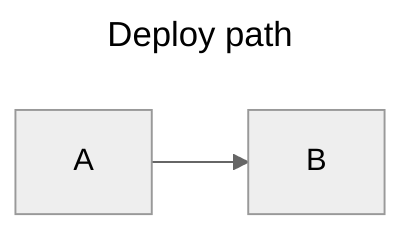
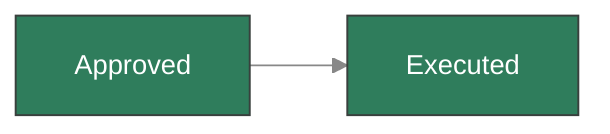
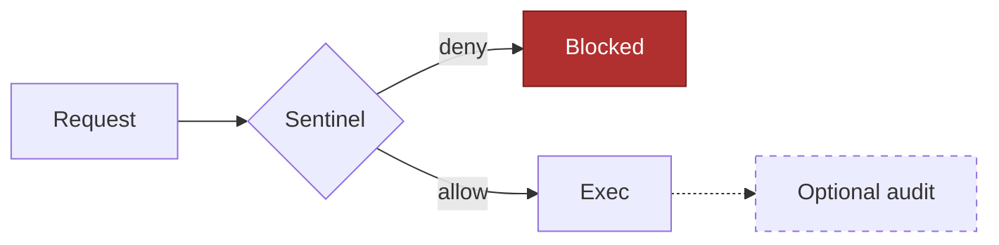

# Styling, Themes and Configuration

The carapace UI renders mermaid with the **app theme**: `default` in light mode, `dark` in
dark mode, re-rendered when the user flips it. Everything below fights that mechanism to
some degree — use the least of it that gets the point across.

## The dark mode rule

A diagram with hardcoded light colors (`fill:#fff`, `stroke:#000`, `color:black`) is
unreadable for anyone using dark mode. Options, best first:

1. **No colors.** Shape, direction and grouping carry meaning fine on their own.
2. **Semantic non-color emphasis** — thick edges (`==>`) for the main path, dotted (`-.->`)
   for optional, `<<choice>>`/diamond shapes for branching.
3. **Mid-tone fills that survive both themes** — saturated colors around 50% lightness with
   no explicit text color, e.g. `fill:#2f7d5c` with white-ish default text.
4. **A pinned theme** — if the diagram truly needs fixed colors, pin the whole diagram to a
   theme so at least it is internally consistent (below).

## Per-diagram config

Front matter inside the fence (preferred, mermaid 10.5+):



Legacy directive, same effect, still common:

```
%%{init: {'theme': 'neutral', 'flowchart': {'htmlLabels': false}}}%%
```

Built-in themes: `default`, `neutral`, `dark`, `forest`, `base`. `neutral` is the safest
pin — it stays legible on both light and dark page backgrounds.

Useful knobs: `flowchart.curve` (`basis`, `linear`, `stepAfter`), `flowchart.nodeSpacing` /
`rankSpacing`, `sequence.mirrorActors: false`, `sequence.wrap: true`, `gantt.barHeight`,
`look: handDrawn` (sketchy style, mermaid 11.3+), `layout: elk` (better layered layouts —
only if the ELK layout package is bundled, otherwise the diagram fails to render).

## Theme variables

With `theme: base`, individual variables become settable:



Common variables: `primaryColor`, `primaryTextColor`, `primaryBorderColor`, `lineColor`,
`secondaryColor`, `tertiaryColor`, `background`, `fontFamily`, `fontSize`. Derived colors
are computed from these — set two or three, not fifteen.

## Styling individual nodes (flowchart)



- `classDef name prop:value,prop:value` defines a class; CSS property names, comma
  separated.
- `A:::className` applies it inline; `class A,B className` applies it to several nodes.
- `style A fill:#eee` styles one node without a class — fine for one-offs, worse for
  three.
- Edge styling: `linkStyle 0 stroke:#f00,stroke-width:2px` (edges are numbered in
  declaration order, which makes it brittle — prefer `==>` and `-.->`).

State, class and ER diagrams support `classDef` and `:::` too. Sequence diagrams do not —
they only have `rect rgb(...)` blocks and box fills.

## Accessibility

```
accTitle: Session lifecycle
accDescr: States from idle through claiming to archived.
```

Both work in every diagram type and end up in the SVG for screen readers. Worth adding to
diagrams that carry real information.

## What is not available

`securityLevel: "strict"` in the UI means:

- **no `click` callbacks** — `click A call fn()` is dropped before it reaches the diagram
  (it needs `securityLevel: "loose"`, which the UI does not use)
- **the SVG is sanitized with DOMPurify** — formatting tags in labels (`<br/>`, `<b>`,
  `<i>`) survive, but scripts, event handlers (`onerror=…`) and anything else dangerous
  are stripped
- **no external icon packs or fonts** — the icon-based shapes (`::icon(fa fa-x)`,
  architecture icons beyond the five built-ins) render as nothing

A diagram cannot lower this itself: `securityLevel` is on mermaid's secure-keys list, so a
`%%{init: {'securityLevel': 'loose'}}%%` directive inside the fence is ignored. Put links
in the prose next to the diagram instead of trying to make `click` work.
